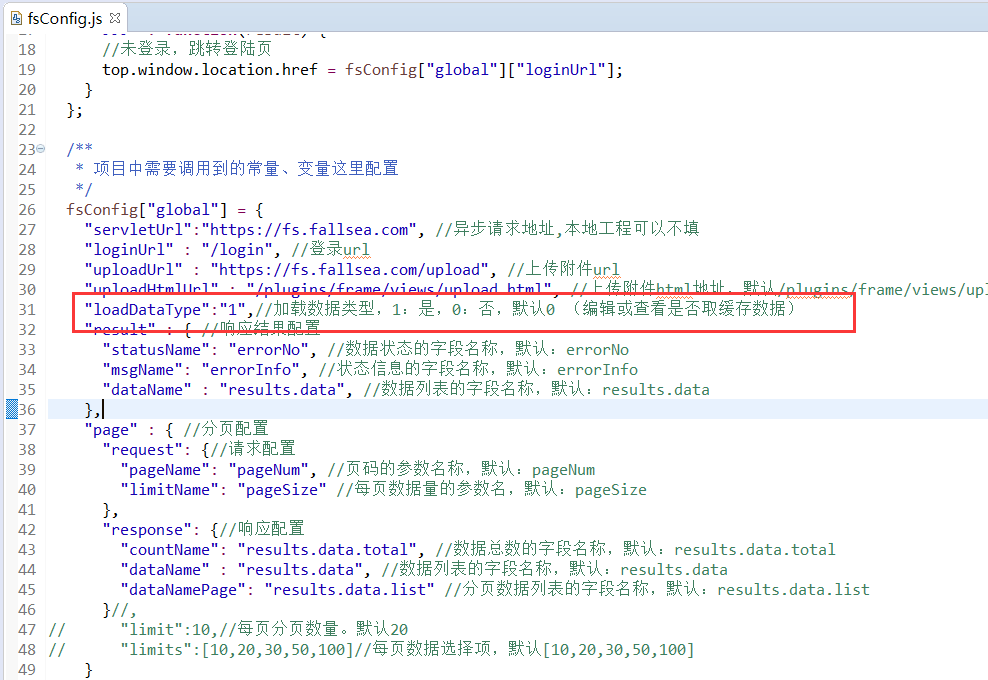

# 编辑/查看 缓存处理

> `缓存`主要使用在`编辑`或`查看`页面查询数据的方式，通过后端servlet接口获取数据还是通过前端缓存获取。缓存可以使用在实时性要求不高的上面。减少后端servlet请求。  


## 配置支持缓存

需要修改插件的配置文件`/plugins/frame/js/fsConfig.js`  

如下图：配置`loadDataType`为`1`，默认支持缓存




## 缓存使用

> `缓存`只能用在数据表格编辑或查看页面，如果需要这些页面从缓存中获取数据，那么只需要`form`不配置`loadUrl`属性即可，如果原有已经配置可以删掉，其他的配置一致。


* 编辑页`支持`缓存配置

```html
<form class="layui-form" id="edit_form" isLoad="1">
</form>
```

* 编辑页`不支持`缓存配置

> **[warning] 配置`loadUrl` ：强制使用servlet地址加载数据。**

```html
<form class="layui-form" id="edit_form" isLoad="1" loadUrl="/fsbus/1003">
</form>
```
