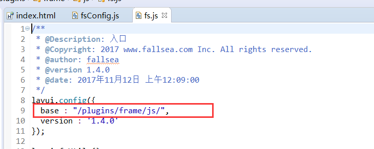
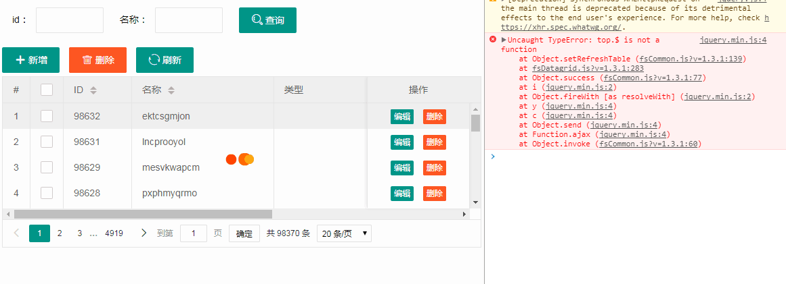
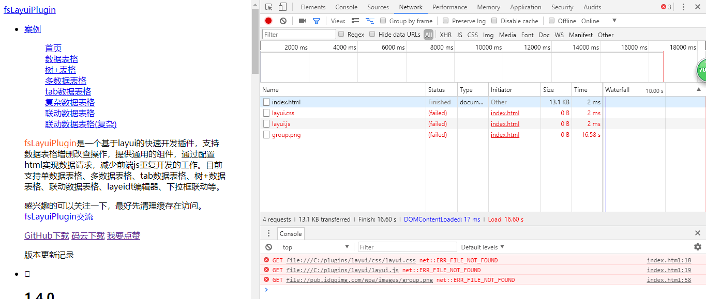
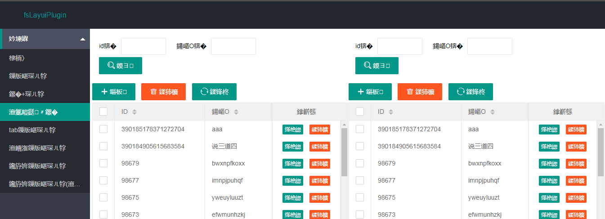
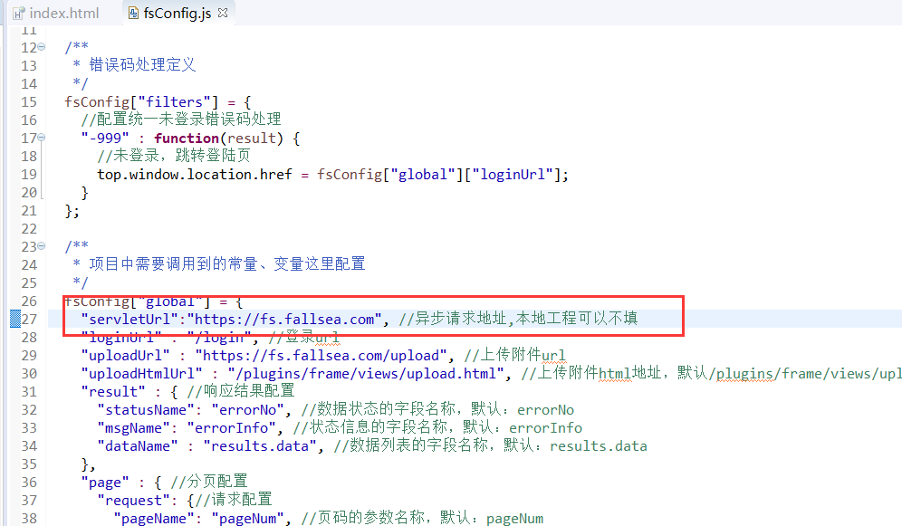

# 常见问题

> **[danger] 本文介绍`fsLayui`使用过程中遇到的问题，看文档前，请一定要通过`F12`查看浏览器的报错信息。**

## 项目中运行页面加载js提示404

请确认是否是`fsCommon.js`，`fsDatagrid.js`，`fsForm.js`，`fsConfig.js` 提示404，如果是说明你把`fsLayuiPlugin`放到了自定义的目录，那么需要修改基础`fs.js`的基础框架路径。可以参考[快速开始](../jc/quickstart.html)

**一般需要在`fs.js`中，增加项目名，例如：`/项目名/plugins/frame/js/`,这里不能写相对路径**

## Uncaught TypeError: top.$ is not a

插件需要获取最顶层`top`页面的对象，项目中没有引入`jquery`就导致报错，请在最顶层页面引入`jquery`。

## 打开页面没有样式

插件必须在容器中运行，不能直接打开html页面，请参考[fsLayuiPlugin入门使用](http://www.itcto.cn/layui/fsLayuiPlugin%E5%85%A5%E9%97%A8%E4%BD%BF%E7%94%A8/)

## 页面访问乱码?

请确认使用的编码是否是`UTF-8`

## 配置url后，请求并没有到自己的后台？

请检查`fsConfig.js`中配置的异步请求地址是否是自己后台的地址。

