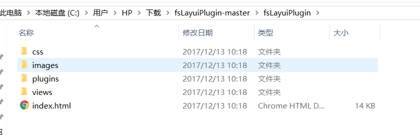
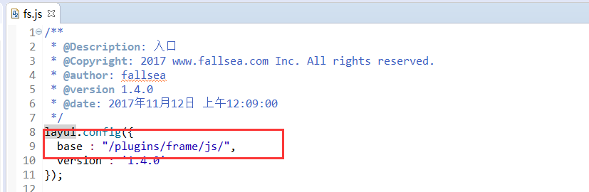
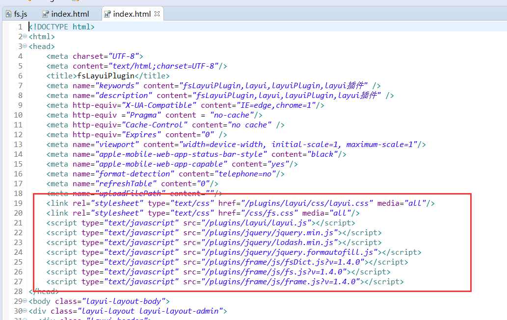
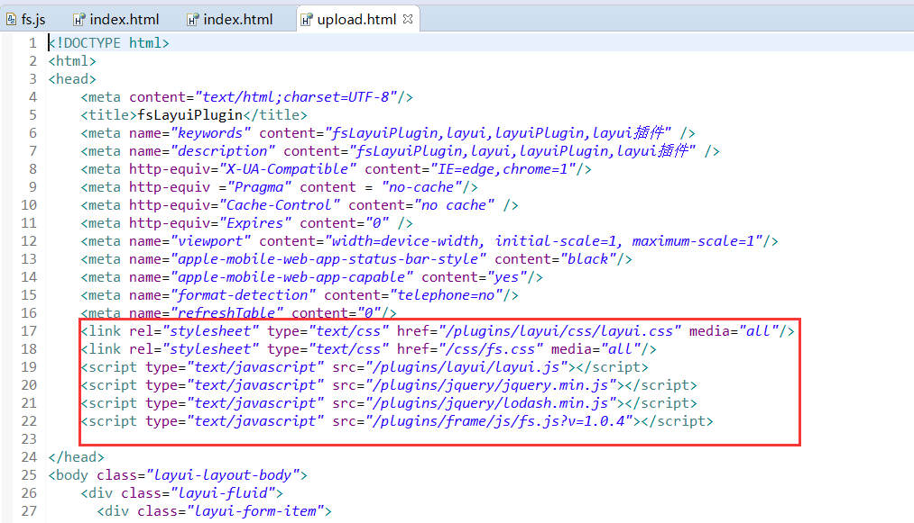

# 本地启动服务

> 源码下载后，不能直接访问静态页面，必须运行在容器中，例如：nodejs、nginx、tomcat、jetty等容器。  
源码中默认配置了nodejs容器，可以直接启动nodejs访问。


## 启动服务

> 默认使用nodejs启动，请先安装nodejs。

```bash
# 进入源码目录
# 安装依赖
npm install

# 建议不要用cnpm安装 会有各种诡异的bug 可以通过如下操作解决 npm 下载速度慢的问题
npm install --registry=https://registry.npm.taobao.org

# 启动服务
npm start
```

浏览器访问 http://localhost:3000


## 开发工具中运行

### 默认目录

> 如果需要在`eclipse`或`IDEA` 中运行，需要把`fsLayui`目录中的信息，拷贝到工程中根目录`WebRoot`下，这样不需要修改配置信息（保证`plugins`在项目根目录），**推荐这种方式**。

* 把下图文件拷贝到项目更目录




### 自定义目录

> **[danger] 重要：一定要加项目名，不然页面访问会报404错误**


> 如果不想把`fsLayui`放到根目录，想放到指定的某个文件夹下面，那么需要修改几个地方。

1. `fs.js`文件的`base`路径（增加项目名）

  

2. `html`demo的js和css引用路径

  

3. `upload.html`文件上传的js和css引用路径
  
