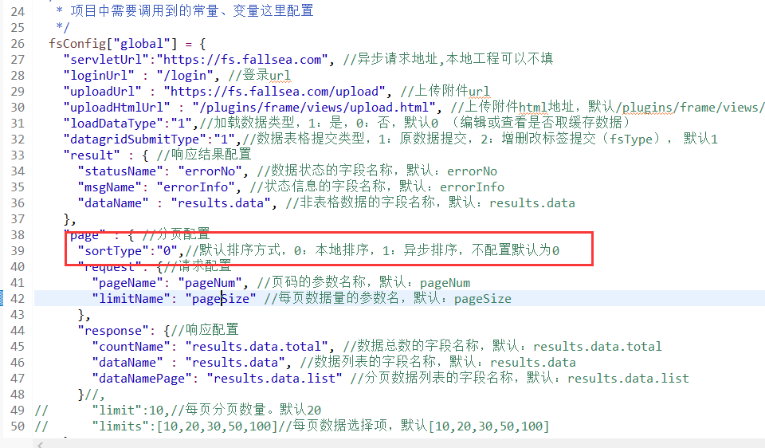

# 数据表格使用说明

数据表格通常使用在列表数据展示，对表格进行增、查、改、删操作。

## 引入框架基础文件

[参考地址](../jc/frame.html)


## 表格基础属性配置

> 表格数据异步加载数据配置，必须指定class样式为`fsDatagrid`，其中表格`id`和`lay-filter`必须保持一致。

```html
<table id="fsDatagrid" lay-filter="fsDatagrid" class="fsDatagrid" isLoad="1" url="/fsbus/1000" isPage="1" sortType="1" pageSize="10" defaultForm="query_form" height="full-135"></table>
```

> **[info] 配置说明**

属性        | 必输 | 默认值   | 名称       | 描述
------------|------|----------|------------|------
id          | 是   |          | 表格id     | 如果只有一个数据表格，id最好为 `fsDatagrid`
lay-filter  | 是   |          | 事件监听id | 必须和表格`id`一致
class       | 是   |          | 样式       | 必须有 `fsDatagrid` 样式
url         | 是   |          | 请求地址   | ajax异步加载数据地址
method      | 否   |  post    | 请求类型   | `post`,`get`
isPage      | 否   |    0     | 是否分页   | 1 分页,0 不分页
sortType    | 否   |    0     |默认排序方式| 0：本地排序，1：异步排序
pageSize    | 否   |    20    | 每页数量   | 指定数据表格每页分页数量
defaultForm | 否   |          | form表单id | 表格查询的前置条件，配置后，默认把此form表单当做datagrid查询条件
height      | 否   | full-135 | 表格高度   | 表格高度，`full`表示表格自适应高度
isLoad      | 否   |    1     |是否自动加载 | 1 默认加载，0 不加载（配置为0后，表格默认填充空数据，点击刷新或者查询才会更新数据，一般在 **联动表格** 使用）
toolbar     | 否   |    false |开启表格头部工具栏区域 | 详细请[参考](https://www.layui.com/doc/modules/table.html#options)
defaultToolbar | 否   |       |自由配置头部工具栏右侧的图标 | `filter`: 显示筛选图标；`exports`: 显示导出图标；`print`: 显示打印图标，多个`逗号`分隔
isTotalRow  | 否   |    0     |是否开启合计行区域 | 1 是，0 否
title  | 否   |          |定义 table 的大标题 | 在文件导出等地方会用到
clickRenderTable | 否   |     |点击行渲染的表格id | 点击表格行，渲染某个table（ **联动表格** 使用）
clickRenderTableInputs | 否 | |点击后传入参数|  自定义需要传入的参数（ **联动表格** 使用）

## 表格显示列配置

> 表格列配置，必须在`table`标签下面定义 `div` 标签，并且class为`fsDatagridCols`，子标签为`p`标签，通过p标签，定义列的属性内容，参考layui官方配置：http://www.layui.com/doc/modules/table.html#cols

```html
<div class="fsDatagridCols">
  <p type="numbers" title="#"/>
  <p checkbox="true"/>
  <p field="id" title="ID" width="100" sort="true"/>
  <p field="name" title="名称" width="30%" sort="true" />
  <p field="type" title="类型" width="150" dict="type"/>
  <p field="city" title="城市" width="100" dict="city"/>
  <p field="sex" title="性别" width="100" />
  <p field="state" title="状态" width="100" templet="#stateTpl"/>
  <p field="area1" title="省份" width="100" dict="area1"/>
  <p field="createdTime" title="创建时间" width="180"/>
  <p field="modifiedTime" title="修改时间" width="180"/>
  <p fixed="right" align="center" toolbar="#barDemo" title="操作" width="220"/>
</div>

<script type="text/html" id="stateTpl">
  <input type="checkbox" name="state" lay-skin="switch" disabled lay-text="开启|关闭" {{ d.state == 1 ? 'checked' : '' }}>
</script>

```

> **[info] 配置说明**

属性        | 必输 | 默认值   | 名称       | 描述
------------|------|----------|------------|------
type        | 否   |          | 设定列类型  | `normal`（常规列，无需设定），`checkbox`（复选框列），`radio`（单选框列），`numbers`（序号列），`space`（空列）
field       | 是   |          | 字段属性     | 展示数据的字段属性
title       | 是   |          | 标题       | 列的标题
width       | 是   |          | 宽度       | 列的宽度
dict        | 否   |          | 数据字典   | 对应的数据字典，配置后，会自动解析数据字典值
sort        | 否   |   false  | 是否排序字段   | `true`：是 `false`：不是
templet     | 否   |          | 模板信息   |  
hide    | 否   |          |是否初始隐藏列    | `true`：是
totalRow    | 否   |          |是否开启该列的自动合计功能    | `true`：是
totalRowText    | 否   |          |用于显示自定义的合计文本    | 
formatType  | 否   |         | 格式化类型   | `date`：日期格式yyyy-MM-dd，`datetime`：时间格式yyyy-MM-dd HH:mm:ss

## 表格中按钮设置

[配置参考](../pz/button.html#数据表格中按钮配置说明)

```html
<script type="text/html" id="barDemo">
  <a class="layui-btn layui-btn-primary layui-btn-xs" lay-event="top" topUrl="views/datagrid/edit.html" topMode="readonly" topWidth="800px" topHeight="600px" topTitle="查看demo" inputs="id:">查看</a>
  <a class="layui-btn layui-btn-xs" lay-event="top" topUrl="views/datagrid/edit.html" topWidth="800px" topHeight="600px" topTitle="编辑demo" inputs="id:">编辑</a>
  <a class="layui-btn layui-btn-danger layui-btn-xs" lay-event="submit" url="/fsbus/1002" isConfirm="1" confirmMsg="是否确定删除当前记录？" inputs="id:">删除</a>
  <a class="layui-btn layui-btn-xs" lay-event="test2" >测试</a>
</script>
```


## 表格查询条件配置

> 为数据表格配置查询条件，只需要关注form表单id和查询按钮配置

```html
<form class="layui-form" id="query_form">
  <div class="layui-form-item">
    <div class="layui-inline">
      <label class="layui-form-mid">id：</label>
      <div class="layui-input-inline" style="width: 100px;">
        <input type="tel" name="id" autocomplete="off" class="layui-input"/>
      </div>
    </div>
    <div class="layui-inline">
      <label class="layui-form-mid">名称：</label>
      <div class="layui-input-inline" style="width: 100px;">
        <input type="text" name="name" autocomplete="off" class="layui-input"/>
      </div>
    </div>
    <div class="layui-inline">
      <label class="layui-form-mid">时间：</label>
      <div class="layui-input-inline" style="">
        <input type="text" name="createDate" autocomplete="off" class="layui-input fsDate" dateRange="1" placeholder=" - "/>
      </div>
    </div>
    <div class="layui-inline">
      <div class="layui-input-inline">
        <button class="layui-btn" type="button" function="query"><i class="layui-icon">&#xe615;</i>查询</button>
      </div>
    </div>
  </div>
</form>
```

> **[info] 配置说明**

属性       | 必输 | 默认值     | 名称           | 描述
-----------|------|------------|---------------|------
function   | 是   |            | 方法名称       | 查询写固定值 `query`
tableId    | 否   | `fsDatagrid` | datagrid表格id | 需要查询的datagrid表格id


## 表格按钮工具栏配置

 通过菜单对数据表格增删改查操作，[配置参考](../pz/button.html)

```html
<button class="layui-btn" function="top" topUrl="views/datagrid/add.html" topWidth="800px" isMaximize="0" topHeight="600px" topTitle="新增demo">
  <i class="layui-icon">&#xe654;</i>新增
</button>
<button class="layui-btn layui-btn-danger" function="submit" url="/fsbus/1002" isMutiDml="1" isConfirm="1" confirmMsg="是否确定删除选中的数据？" inputs="id:">
  <i class="layui-icon">&#xe640;</i>批量删除
</button>
<button class="layui-btn" function="refresh">
  <i class="layui-icon">&#x1002;</i>刷新
</button>
```


## 数据排序

> 支持本地排序和异步排序，本地排序是官方的方式，只能排序当前页的数据（前端缓存数据排序）；异步排序支持服务端排序，排序通过服务端处理。


### 全局默认排序配置

 可以通过全局默认配置，管理数据表格的默认排序方式。全局默认配置在`fsConfig.js`中，修改配置`sortType`信息

`sortType`：默认排序方式，0：本地排序，1：异步排序，不配置默认为0




### 表格指定排序方式

> 数据表格可以指定排序方式，指定后，强制使用此排序方式。只需要在`table`中新增`sortType`属性，如果未配置此属性，则获取默认的排序方式。

使用示例：

```html
<table sortType="1"></table>
```

### 异步排序

> 数据表格使用异步排序后，需要后台数据接口支持才行，`异步排序`数据接口会携带两个参数，通过此参数实现排序数据。

参数信息 ：

`field`：排序的字段

`order`：排序的方式`asc`,`desc`

[点击体验异步排序](http://fslayui.wueasy.com/index.html#datagrid)
