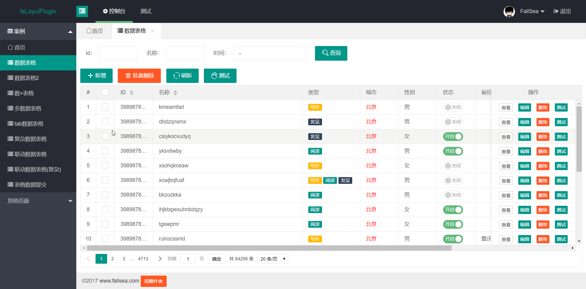

# 按钮事件使用说明

介绍系统事件和自定义事件


## 系统按钮事件

框架中定义了一些系统常用的按钮处理函数，只需要配置调用方式即可使用。

> 可以通过按钮配置。直接对数据表格增删改查快捷操作。


> **[info] inputs参数说明**

 1. 把当前选中的行id传入请求，可以配置 `id:`
 2. 传入固定的指，可以配置 `属性:值` ,示例： `state:1`
 3. 传入的参数和选中的列参数不一样，可以配置 `属性:$对应值的属性` ，示例：`uid:$id`
 4. 传入的参数取某一个输入框的值，可以配置 `属性:#输入框id` ，示例：`name:#name`
 5. 需要传多个参数直接通过 `,` 分割，示例： `id:,state:1`

### 常规按钮配置说明

 通过菜单对数据表格增删改查操作

```html
<button class="layui-btn" function="top" topUrl="views/datagrid/add.html" topWidth="800px" isMaximize="0" topHeight="600px" topTitle="新增demo">
  <i class="layui-icon">&#xe654;</i>新增
</button>
<button class="layui-btn layui-btn-danger" function="submit" url="/fsbus/1002" isMutiDml="1" isConfirm="1" confirmMsg="是否确定删除选中的数据？" inputs="id:">
  <i class="layui-icon">&#xe640;</i>批量删除
</button>
<button class="layui-btn" function="refresh">
  <i class="layui-icon">&#x1002;</i>刷新
</button>
<button class="layui-btn" function="test">
  <i class="layui-icon">&#xe756;</i>测试
</button>
```

> **[info] 配置说明**

属性       | 必输 | 默认值                  | 名称         | 描述
-----------|------|-------------------------|--------------|------
function   | 是   |                         | 方法名称     | `top`：弹出窗口，`submit`：提交数据，`refresh`：刷新表格，`close`：关闭窗口，`query`：查询，`upload`：上传附件，`uploadHeadImage`：上传头像，`addRow`：增加一行记录，`save`：保存，`download`：下载，`right`：右边窗口，`其他值`：自定义事件
topUrl     | 否   |                         | 弹出窗口地址 | 事件监听为top，此属性必输
topWidth   | 否   |   700px                 | 弹出窗口宽度 |
topHeight  | 否   |   400px                 | 弹出窗口高度 |
isMaximize | 否   |       0                 | 弹出窗口是否最大化 | 1：是， 0：否
topTitle   | 否   |                         | 弹出窗口标题 |
requestSuccessCallback | 否 |               | 请求成功回调函数 |
topMode    | 否   |                         | 弹出窗口模型 | `add`：新增窗口，`edit`：编辑窗口，`readonly`：只读窗口； **新增、修改、查看共用同一个页面使用**
url        | 否   |                         | 提交请求地址 | 事件监听为`submit`，此属性必输
method     | 否   |  post                   | 请求类型   | `post`,`get`
isSelect   | 否   |                         | 是否单选     | 1：是，0：否
isMutiDml  | 否   |                         | 是否多选     | 1：是，0：否
isConfirm  | 否   |    0                    | 是否确认提示 | 1：是，0：否
confirmMsg | 否   | 是否确定操作选中的数据? | 确认提示内容 |  `isConfirm`为1时有效
inputs     | 否   |                         | 业务参数     | 自定义需要传入的参数
tableId    | 否   | fsDatagrid              |datagrid表格id| 需要操作的表格id


### 数据表格中按钮配置说明

```html
<script type="text/html" id="barDemo">
  <a class="layui-btn layui-btn-primary layui-btn-xs" lay-event="top" topUrl="views/datagrid/edit.html" topMode="readonly" topWidth="800px" topHeight="600px" topTitle="查看demo" inputs="id:">查看</a>
  <a class="layui-btn layui-btn-xs" lay-event="top" topUrl="views/datagrid/edit.html" topWidth="800px" topHeight="600px" topTitle="编辑demo" inputs="id:">编辑</a>
  <a class="layui-btn layui-btn-danger layui-btn-xs" lay-event="submit" url="/fsbus/1002" isConfirm="1" confirmMsg="是否确定删除当前记录？" inputs="id:">删除</a>
  <a class="layui-btn layui-btn-xs" lay-event="test2" >测试</a>
</script>
```

> **[info] 配置说明**

属性       | 必输 | 默认值                  | 名称         | 描述
-----------|------|-------------------------|--------------|------
lay-event  | 是   |                         | 事件监听方式 | `top`：弹出窗口；`submit`：提交数据；`delRow`：删除当前行记录；`其他值`：自定义事件
topUrl     | 否   |                         | 弹出窗口地址 | 事件监听为`top`，此属性必输
topWidth   | 否   |   700px                 | 弹出窗口宽度 |
topHeight  | 否   |   400px                 | 弹出窗口高度 |
isMaximize | 否   |       0                 | 弹出窗口是否最大化 | 1：是， 0：否
topTitle   | 否   |                         | 弹出窗口标题 |
requestSuccessCallback | 否 |               | 请求成功回调函数 | 
topMode    | 否   |                         | 弹出窗口模型 | `add`：新增窗口，`edit`：编辑窗口，`readonly`：只读窗口； **新增、修改、查看共用同一个页面使用**
url        | 否   |                         | 提交请求地址 | 事件监听为`submit`，此属性必输
method     | 否   |  `post`                 | 请求类型     | `post`,`get`
isConfirm  | 否   |    0                    | 是否确认提示 | 1：是，0：否
confirmMsg | 否   | 是否确定操作选中的数据?   | 确认提示内容 |
inputs     | 否   |                         | 业务参数     | 自定义需要传入的参数


## 自定义按钮事件

框架中定义了一些系统常用的按钮处理函数，只需要配置调用方式即可，这样大大提高了开发的效率，也存在一个弊端，那就是有些按钮需要特殊处理，系统默认不满住情况下，只能修改源码`fsDatagrid.js`或`fsCommon.js`中的内容，修改后对以后升级工作量就比较大，而且容易出现升级问题。[点击体验效果](http://fslayui.wueasy.com/index.html#datagrid)

> **[info] 最终新增了自定义按钮处理函数，可以根据自己的情况来自定义处理，满足个性化需求。**

自定义按钮事件回调，区分两个模式：
1. 全局的按钮事件定义
2. 单页面的按钮事件定义

> **[warning] 特殊说明：使用自定义函数，必须所有处理自己来实现。**


### 全局事件定义

`全局事件`主要争对一些通用的处理函数（其他页面也可能会用到同样的处理方式，称之为`通用`）。


全局事件在`FsButtonCommon.js`文件中定义，例如以下demo

```javascript
FsButtonCommon.prototype.test = function(elem,data,datagrid,fsCommon){
  alert("测试自定义按钮"+JSON.stringify(data));
}
```

**代码分析：**

`test`是定义一个函数方法名称(事件名称)

方法中目前有3个参数，根据实际需要求处理。

参数说明:
1. `elem`：当前点击按钮元素
2. `data`：当前选中表格的数据
3. `datagrid`：表格对象


### 单页面事件定义

`单页面事件`主要争对一些比较个性化的页面处理（只有在当前页面可以使用）。

`处理事件函数`可以在一个js文件中，也可以在当前html文件中编写处理函数。


如下demo在html文件中定义

```html
<script type="text/javascript">
layui.fsButton.test2 = function(elem,data,datagrid){
	alert("测试自定义按钮2"+JSON.stringify(data));
}
</script>
```

> 代码分析：

处理事件必须在`layui.fsButton`对象中。

`test2`是定义一个函数方法名称(事件名称)

方法中目前有3个参数，根据实际需要求处理。

> 参数说明:

1. `elem`：当前点击按钮元素
2. `data`：当前选中表格的数据
3. `datagrid`：表格对象


### 效果图


