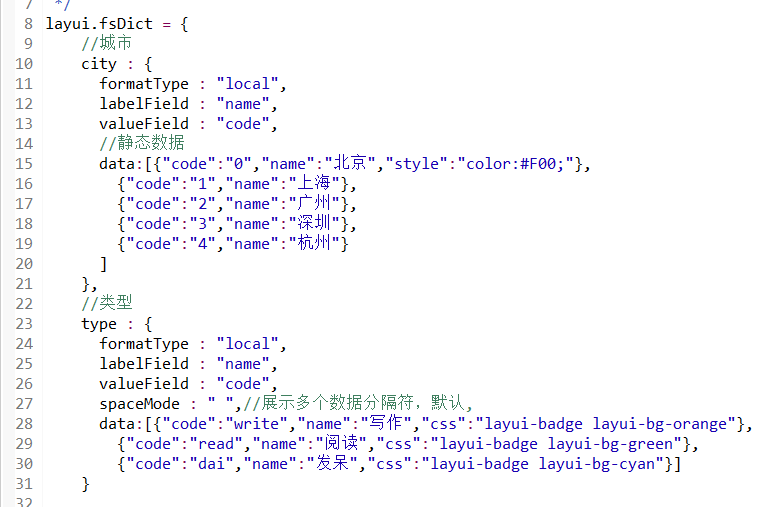
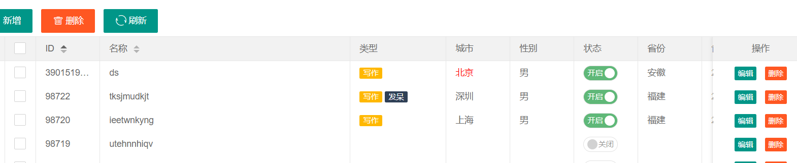

# 数据字典使用说明

数据字典主要解决下拉框数据填充和数据表格转义处理，一个数据字典可以多处使用。    
1.多个页面下拉框使用同样的数据，改一个地方需要把所有页面都要修改  
2.数据表格转义代替自己手动写`templet`解析模板

> 数据字典提供一个通用的处理方式，支持配置`静态数据字典`和`动态数据字典`，，数据字典文件地址`plugins/frame/js/fsDict.js`。


如果使用`数据字典`，必须在`layui.js` 后面引入数据字典文件`/plugins/frame/js/fsDict.js`

```html
<script type="text/javascript" src="/plugins/frame/js/fsDict.js"></script>
```


## 静态数据字典

> 静态数据字典通常用于不会改变的数据，例如：文章状态（有效，无效，发布，审核），用户状态（有效，无效，锁定）

### 字典配置

在`layui.fsDict`对象中，定义一个数据字典。

例如：定义一个城市的静态数据字典  

1. 配置`城市`数据字典名称：`city`,`city` 是一个json对象
2. 配置`数据字典属性`，必须指定data指，并且是一个json数组


```javascript
layui.fsDict = {
    //城市
    city : {
      formatType : "local", //local 静态数据字典
      labelField : "name", //展示数据的属性
      valueField : "code", //value对应的属性
      //静态数据，数组
      data:[{"code":"0","name":"北京","style":"color:#F00;"},
        {"code":"1","name":"上海"},
        {"code":"2","name":"广州"},
        {"code":"3","name":"深圳"},
        {"code":"4","name":"杭州"}
      ]
    }
  }
```

### 数据表格转义引用数据字典

只需要在表格列中，配置数据字典信息`dict="city"`

```html
<p field="city" title="城市" width="100" dict="city"/>
```

### 数据表格转义展示不同的样式

如果表格需要对不同的信息展示不同的样式，在数据`data`中，定义`style`或`css`,可以通过此方式对不同的数据进行不同样式展示






### 下拉框引用数据字典

需要在select中配置css样式`class="fsSelect"`和字典配置`dict="city"`，`addNull="1"`描述增加一个空的选项

```html
<select name="city" lay-verify="required"  lay-verType="tips" class="fsSelect" dict="city" addNull="1">
</select>
```

## 动态数据字典

> 动态数据字典使用场景比较多，例如省市区级联等会改变的类型。  
通过服务端异步请求加载数据列表。

### 字典配置

在`layui.fsDict`对象中，定义一个数据字典。

例如：定义一个城市的静态数据字典  

1. 配置`省份`数据字典名称：`city`,`city` 是一个json对象
2. 配置`数据字典属性`


```javascript
layui.fsDict = {
    //省份
    area1 : {
      formatType : "server", //server 动态数据字典
      loadUrl : "/fsbus/1005", //异步加载数据的url地址
      method : "get",//指定请求类型，默认post
      inputs : "parentid:0", //异步请求携带的参数
      labelField : "name", //示数据的属性
      valueField : "id" //value对应的属性
    }
  }
```

### 数据表格转义引用数据字典

只需要在表格列中，配置数据字典信息`dict="area1"`

```html
<p field="area1" title="省份" width="100" dict="area1"/>
```

### 下拉框引用数据字典

需要在select中配置css样式`class="fsSelect"`和字典配置`dict="area1"`

```html
<select name="area1" class="fsSelect" dict="area1" addNull="1">
</select>
```

## 静态字典和动态字典区别

静态字典和动态字典html使用上没有任何区别，主要区别在于`fsDict.js`中的配置方式不一样，获取数据方式。

## 字典配置说明

属性        | 必输 | 默认值   | 名称       | 描述
------------|------|----------|------------|------
formatType  | 是   |          | 格式化方式   | `server`：动态字典，`local`：静态字典
loadUrl     | 否   |          | 异步加载url | 异步加载数据的url地址
method      | 否   |  post    | 请求类型    | `post`,`get`
inputs      | 否   |          | 参数       | 异步请求携带的参数
labelField  | 是   |          | 展示数据的属性  | 显示信息对应的字段
valueField  | 是   |          | value对应的属性 | value值对应的字段
data        | 否   |          | 静态数据数组    | 静态数据字典使用
spaceMode   | 否   |   ,      | 展示多个数据分隔符| 数据表格转义时使用，多个数据的分隔符

* inputs参数使用说明

如果使用固定参数，可以直接`属性:值`，demo：`parentid:0`，如果需要多个参数可以通过`,`分割，demo：`parentid:0,name:test`   
联动表格如果要传入当前选中的值，可以直接`属性:`，不需要写值，默认直接获取当前选中的，demo：`parentid:`。  
如果需要传入其他选择器的值，可以配置`属性:#选择器id`，例如：`key:#area2222222`
